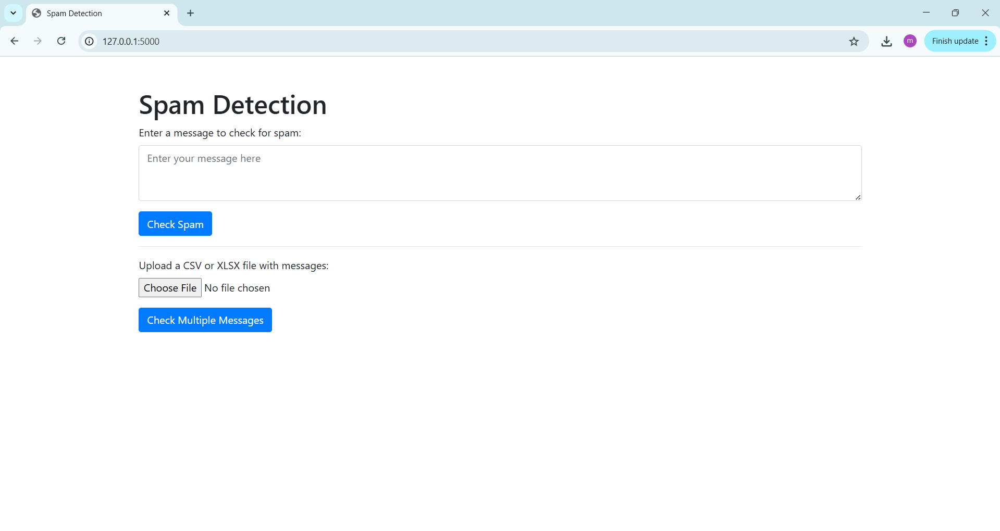

# Spam Detection Application

## Overview
This project is a **Spam Detection** application built using **Flask**, **Natural Language Processing (NLP)**, and a **Multinomial Naive Bayes (NB)** model. It allows users to detect spam messages by either entering a single message or uploading a file containing multiple messages. The backend uses a trained Multinomial Naive Bayes classifier to make predictions based on the content of the messages.

---


## Features

- **Single message prediction**: Users can enter a message manually to check if it is spam or not.
- **Multiple message prediction**: Users can upload a CSV or XLSX file containing messages, and the application will predict whether each message is spam or not.
- **Downloadable results**: After processing a file, users can download a CSV file with the results of spam classification.
- **Interactive Web Interface**: A simple and user-friendly web interface built using HTML and Bootstrap.

---
[](https://youtu.be/-HGHxbgXGOU)

## Usage
🔹 Single Message Input:

Enter a message in the input field.

Click "Check Spam" to view the prediction.

🔹 File Upload for Bulk Predictions:

Upload a .csv or .xlsx file containing a column named message.

Click "Check Multiple Messages" to process the file.

Results will display in a table format.

Click "Download Result File" to save the output as a CSV.


## Project Overview

This project includes:

- **Flask** for the backend API and web server.
- **Natural Language Processing (NLP)** for preprocessing and cleaning the input messages.
- **Multinomial Naive Bayes (NB)** model for classifying the messages into spam or not spam.

---

## Technologies Used

- **Backend**: Flask
- **NLP**:
  - NLTK (Natural Language Toolkit) for text preprocessing (lemmatization, stopword removal)
  - `contractions` package to expand contractions (e.g., "don't" → "do not")
- **Machine Learning**: Scikit-learn (Multinomial Naive Bayes)
- **Frontend**: HTML, CSS (Bootstrap)
- **Data Handling**: Pandas for CSV/XLSX reading and manipulation

---

## Model Training

The spam detection model was trained using a **Multinomial Naive Bayes** classifier.

### 📊 Performance Metrics:

- **Accuracy**: 97.66%
- **Precision**:  
  - Not Spam: 0.99  
  - Spam: 0.90  
- **Recall**:  
  - Not Spam: 0.98  
  - Spam: 0.95  
- **F1-Score**:  
  - Not Spam: 0.99  
  - Spam: 0.92  
- **Macro Average F1-Score**: 0.95  
- **Weighted Average F1-Score**: 0.98  

### 🧠 Model Pipeline:

- Data cleaning and preprocessing using NLTK and regex.
- Vectorization using **BoW**.
- Classification using **Multinomial Naive Bayes**.
- Model and vectorizer serialized using `joblib`.

---


---

## Installation Guide

### 💻 Setup Steps

1. **Clone the repository:**

```bash
git clone https://github.com/sameeratanveer/spam-detection-flask-nlp-multinomialNB.git
cd spam-detection-flask-nlp-multinomialNB
```
2. **Create a virtual environment:**
```
python -m venv venv
source venv/bin/activate  # On Windows: venv\Scripts\activate
```
3. **Install dependencies:**
```
pip install -r requirements.txt
```
4. **Ensure model files exist:*

Place spam_model.pkl and vectorizer.pkl inside the models/ directory.

5. **Run the application:**
```
python app.py
```
6. **Open in browser:**
Visit http://127.0.0.1:5000


